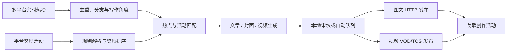

# Toutiao Auto Publisher

[](https://github.com/xc-2000/toutiao-auto-publisher/actions/workflows/ci.yml)
[](https://www.python.org/)
[](https://nodejs.org/)
[](LICENSE)

面向头条创作者的本地 AI 内容工作台：聚合实时热点，生成图文、封面和视频，管理多账号自动化，发现创作奖励活动，并通过 HTTP/VOD 协议保存草稿或发布作品。

项目不上传账号凭据；Cookie、模型密钥、应用用户和生成内容默认只保存在本机 `state/` 租户目录中。

## 功能概览

| 模块 | 能力 |
| --- | --- |
| 实时热点 | 聚合头条、百度、微博、知乎、抖音、B站、CSDN、AcFun、Hacker News；跨平台去重和分类 |
| AI 图文 | 生成标题、摘要、正文、标签和 3:2 封面，支持 OpenAI-compatible 模型 |
| AI 视频 | 自定义视频模型、时长与画幅，支持多片段拼接、TTS、音频处理和本地预览 |
| 创作任务 | 读取进行中的图文/视频活动、奖励、规则和参与状态；支持文本、Magic 配置和规则长图 OCR |
| 变现匹配 | 自动扫描奖励活动，按热点相关度和奖励排序，生成与发布时绑定对应活动 |
| 协议发布 | 图文写入 `activity_tag`，视频写入 `ActivityTag`；支持保存草稿和正式发布 |
| 多账号自动化 | 每个头条账号独立配置频率、选题数、内容类型、发布方式、热点范围和自动领取任务 |
| 数据隔离 | 应用登录/注册、管理员用户管理、租户级账号/模型/任务/草稿隔离 |
| 任务管理 | 内容库、生成进度、失败恢复、重新生成、编辑、预览和分页查询 |

## 工作流程



更完整的模块说明见 [docs/ARCHITECTURE.md](docs/ARCHITECTURE.md)。

## 环境要求

- Python 3.11 或更高版本
- Node.js 20 或更高版本
- Google Chrome，用于平台安全运行时请求
- 一个可用的 OpenAI 或 OpenAI-compatible 模型服务
- 可选：FFmpeg，用于视频拼接、音频与 TTS 处理
- 可选：Tesseract，可增强活动规则长图 OCR

Windows 会自动尝试使用系统中文字体。Linux 建议安装 Noto CJK 或文泉驿字体。

## 快速开始

### Windows PowerShell

```powershell
git clone https://github.com/xc-2000/toutiao-auto-publisher.git
cd toutiao-auto-publisher

py -3.11 -m venv .venv
.\.venv\Scripts\Activate.ps1
python -m pip install --upgrade pip
pip install -r requirements.txt
npm ci

Copy-Item config.example.toml config.toml
$env:OPENAI_API_KEY = "YOUR_API_KEY"
python dashboard.py --config config.toml
```

### Linux / macOS

```bash
git clone https://github.com/xc-2000/toutiao-auto-publisher.git
cd toutiao-auto-publisher

python3 -m venv .venv
source .venv/bin/activate
python -m pip install --upgrade pip
pip install -r requirements.txt
npm ci

cp config.example.toml config.toml
export OPENAI_API_KEY="YOUR_API_KEY"
python dashboard.py --config config.toml
```

打开 <http://127.0.0.1:8765/>。首次注册的应用用户会成为管理员。

## 初始配置

### 1. 模型

默认读取 `OPENAI_API_KEY`。也可以在“设置 -> 模型配置”中分别添加文章、封面和视频模型：

- `Base URL`
- `Model`
- `API Key`
- 文章模型：`Temperature`、`JSON Mode`
- 封面模型：尺寸、质量
- 视频模型：创建路径、时长、画幅、轮询间隔、超时

示例：

```toml
[ai]
base_url = "https://api.openai.com/v1"
api_key_env = "OPENAI_API_KEY"
model = "gpt-4.1-mini"

[cover]
base_url = "https://api.openai.com/v1"
api_key_env = "OPENAI_API_KEY"
model = "gpt-image-1"

[video]
base_url = "https://api.openai.com/v1"
api_key_env = "OPENAI_API_KEY"
model = "sora-2"
```

### 2. 头条账号

进入“设置 -> 头条号账号”：

1. 选择扫码登录。
2. 使用今日头条 App 扫描二维码并确认。
3. 登录完成后，账号资料与会话会加密保存到当前应用用户的租户目录。
4. 可继续添加多个头条账号，并为每个账号配置独立自动化策略。

也可通过 `TOUTIAO_COOKIE` 和 `TOUTIAO_HEADERS_JSON` 导入已有会话，变量模板见 [.env.example](.env.example)。

### 3. 自动化

在“自动化”页面为每个账号设置：

- 开关与运行间隔
- 每轮选题数量
- 图文或视频内容类型
- 保存草稿或直接发布
- 热点分类与来源范围
- 自动领取创作任务

开启“自动领取任务”后，每轮会扫描全部进行中的图文和视频活动，更新账号级领取记录，并为当前内容类型选择最匹配的奖励活动。平台没有独立领取接口；活动参与状态会在关联作品提交后由平台记录。

## 创作任务与奖励活动

“创作任务”页面使用平台活动接口读取：

```text
GET /mp/agw/activity/get_all_category/
GET /mp/agw/activity/list/v2/
GET /mp/agw/activity/detail/v3/
GET /mp/agw/activity/get_activity_article_api/
```

规则解析顺序：

1. `detail/v3` 的文本规则
2. Magic 活动页内嵌的 `taskConfigList` / `rule_data`
3. 规则长图及中文 OCR

系统会识别单次、每日和每周任务。每日任务次日恢复领取状态，每周任务在下一个自然周恢复。已结束活动通过 `act_status=2` 从列表源头排除。

自动化匹配按以下顺序排序：

1. 投稿体裁兼容
2. 热点与活动标题、简介、分类的相关度
3. 平台标注的奖励金额

生成任务会保存活动 ID、标题、奖励、周期和匹配分数；图文发布写入 `activity_tag`，视频发布写入 `ActivityTag`。

## 协议发布

### 图文

```text
POST /spice/image
POST /mp/agw/article/publish
```

### 视频

```text
GET  /ixigua/api/upload/getAuthKey/
GET  https://vod.bytedanceapi.com/?Action=ApplyUploadInner...
POST https://TOS_HOST/STORE_URI
POST https://vod.bytedanceapi.com/?Action=CommitUploadInner...
GET  /ixigua/api/upload/GetVideoMeta
GET  /ixigua/api/upload/GetPosterList/
POST /xigua/api/upload/PublishVideo
```

最终保存请求通过本地普通 Chrome 页面上下文提交，由平台页面 SDK 生成动态安全参数。该链路不操作网页编辑器，也不依赖外部 Playwright 脚本。

平台接口和安全参数可能随时调整。遇到兼容性问题时，请附脱敏日志提交 Issue。

## 命令行

检测头条会话：

```bash
python toutiao_publisher.py --config config.toml session-check
```

只生成本地文章：

```bash
python toutiao_publisher.py generate --topic "普通人如何建立可靠的知识管理系统"
```

构造图文发布 payload，不上传或提交：

```bash
python toutiao_publisher.py run --topic "AI 工具如何改变内容生产" --dry-run
```

上传已有草稿：

```bash
python toutiao_publisher.py publish drafts/ARTICLE.json --cover covers/COVER.jpg --mode draft
```

## 本地数据与安全

以下文件不会进入 Git：

| 路径 | 内容 |
| --- | --- |
| `config.toml`、`.env` | 本地配置和环境变量 |
| `state/` | 应用用户、头条账号、Cookie、模型密钥、数据库和 Chrome 配置 |
| `artifacts/` | 脱敏协议日志和运行报告 |
| `drafts/`、`covers/`、`videos/` | 生成内容 |
| `work/` | 临时测试与中间文件 |
| `assets/fonts/*` | 用户自行提供的本地字体 |

账号 Cookie 和模型 API Key 使用 Fernet 加密，但密文与 `.secret-key` 同时泄露后仍可恢复。请按凭据文件管理整个 `state/` 目录。

提交代码前运行：

```bash
python scripts/check_secrets.py
```

安全问题请按 [SECURITY.md](SECURITY.md) 私下报告。

## 责任说明

本项目是独立开源工具，与字节跳动、今日头条及其他数据来源平台不存在隶属或合作关系。使用者应自行审核生成内容，确保账号操作、素材使用和发布行为符合适用的平台规则与法律法规。平台接口、活动规则和风控策略可能变化，本项目不承诺持续可用、审核结果、流量表现或任务收益。

完整条款与运行风险说明见 [DISCLAIMER.md](DISCLAIMER.md)。

## 测试

```bash
pip install pytest
python scripts/check_secrets.py
python -m pytest tests -q
python -m py_compile dashboard.py toutiao_challenges.py toutiao_publisher.py
npm test
```

GitHub Actions 会在 Python 3.11 和 3.13 上执行相同检查。

## 项目结构

```text
.
|-- dashboard.py              # FastAPI Dashboard、任务队列与自动化
|-- hot_topics.py             # 多平台热榜聚合
|-- toutiao_challenges.py     # 创作活动与规则解析
|-- toutiao_protocol.py       # 图文发布协议
|-- toutiao_video.py          # 视频上传与发布协议
|-- toutiao_publisher.py      # 文章/封面生成与 CLI
|-- video_generation.py       # 视频生成、拼接与音频处理
|-- chrome_protocol_bridge.py # Chrome 安全运行时桥接
|-- web/                      # 原生 HTML/CSS/JavaScript 前端
|-- tests/                    # 协议、账号、任务与恢复测试
|-- scripts/                  # 发布前检查脚本
|-- docs/                     # 架构与开发文档
`-- config.example.toml       # 无敏感信息的配置模板
```

## 常见问题

### 页面提示未登录头条账号

进入“设置 -> 头条号账号”重新扫码，或更新本地 Cookie。账号会话失效不会影响已生成的本地内容。

### 图文保存返回平台校验错误

确认 Chrome 可执行文件路径正确，重新检测账号会话，并检查平台页面是否新增验证码或协议字段。

### 视频生成完成但下载失败

检查模型返回的下载地址、代理配置和 FFmpeg；中国大陆网络访问海外 CDN 时可在 `[video]` 配置代理。

### 中文封面文字显示异常

Windows 会尝试系统中文字体。Linux 安装 Noto CJK，或将具有适当许可证的字体放入 `assets/fonts/` 并配置 `cover.font_path`。

### 活动详情没有文本规则

部分活动只提供 Magic 配置或规则长图。安装 Tesseract 后可启用中文 OCR；仓库已包含 `chi_sim.traineddata`。

## 贡献

提交 Issue 或 Pull Request 前请阅读 [CONTRIBUTING.md](CONTRIBUTING.md) 和 [CODE_OF_CONDUCT.md](CODE_OF_CONDUCT.md)。协议字段相关修改需要附脱敏结构和测试。

## 许可证

项目使用 [MIT License](LICENSE)。第三方模型数据与依赖许可证见 [THIRD_PARTY_NOTICES.md](THIRD_PARTY_NOTICES.md)。
