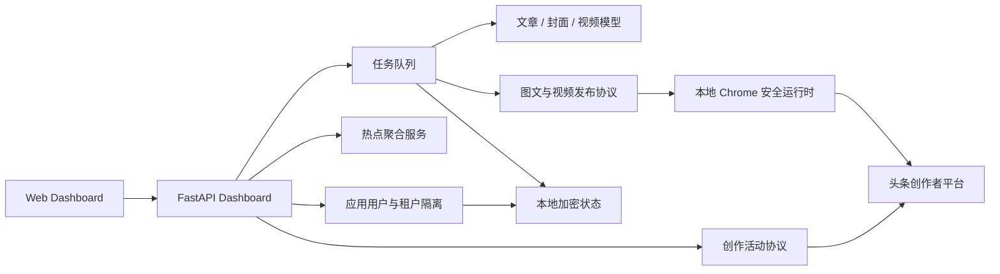

# 架构说明

## 组件关系



## 后端模块

| 文件 | 职责 |
| --- | --- |
| `dashboard.py` | FastAPI 路由、租户运行时、任务队列和自动化调度 |
| `app_auth.py` | 应用用户注册、登录、角色和签名会话 |
| `db.py` | 状态持久化与旧数据迁移 |
| `hot_topics.py` | 多平台热榜采集、合并、分类和写作角度 |
| `model_profiles.py` | 文章、封面、视频模型配置和密钥加密 |
| `toutiao_accounts.py` | 头条账号、二维码登录和会话加密 |
| `toutiao_challenges.py` | 创作活动列表、详情、Magic 规则与 OCR |
| `toutiao_protocol.py` | 图文上传与发布协议 |
| `toutiao_video.py` | 视频 VOD/TOS 上传与发布协议 |
| `toutiao_publisher.py` | 文章生成、封面生成和命令行入口 |
| `video_generation.py` | 视频生成、轮询、下载、拼接与音频处理 |
| `chrome_protocol_bridge.py` | 在本地 Chrome 页面上下文完成平台安全参数请求 |

## 数据边界

每个应用用户使用独立租户目录：

```text
state/tenants/<USER_ID>/
  accounts.json
  dashboard.json
  models.json
  .secret-key
  chrome-protocol-profiles/
  covers/
  drafts/
  videos/
```

这些文件均属于运行时数据，不进入 Git。账号 Cookie 和模型 API Key 使用 Fernet 加密；`.secret-key` 与密文需要同时保护。

## 发布链路

### 图文

1. 生成文章 JSON 和封面。
2. 上传封面并取得 URI。
3. 构造图文发布表单。
4. 通过 Chrome 页面上下文提交发布接口。
5. 若任务绑定活动，则写入 `activity_tag`。

### 视频

1. 生成视频并按配置执行拼接、TTS 和音频处理。
2. 获取 VOD 上传凭据。
3. 申请 TOS 上传节点并提交二进制。
4. 提交 VOD、读取元数据和封面。
5. 构造 `PublishVideo` JSON；绑定活动时写入 `ActivityTag`。

## 自动化与变现任务

每个账号保存独立自动化策略。调度器按周期刷新热点和进行中的创作活动，建立账号级领取记录，再按以下顺序选择活动：

1. 当前内容类型兼容性
2. 热点与活动标题/简介/分类的相关度
3. 平台标注的最高奖励

生成任务会持久化活动 ID、标题、奖励、周期、匹配分数和投稿类型，后续发布始终使用创建任务时绑定的账号与活动。

## 扩展点

- 新热点源：在 `hot_topics.py` 增加采集器并补测试。
- 新模型服务：通过 OpenAI-compatible 配置或扩展生成器适配层。
- 新活动规则来源：在 `toutiao_challenges.py` 增加结构化解析器。
- 新发布体裁：新增协议客户端，并通过 `JobManager` 接入统一状态机。
